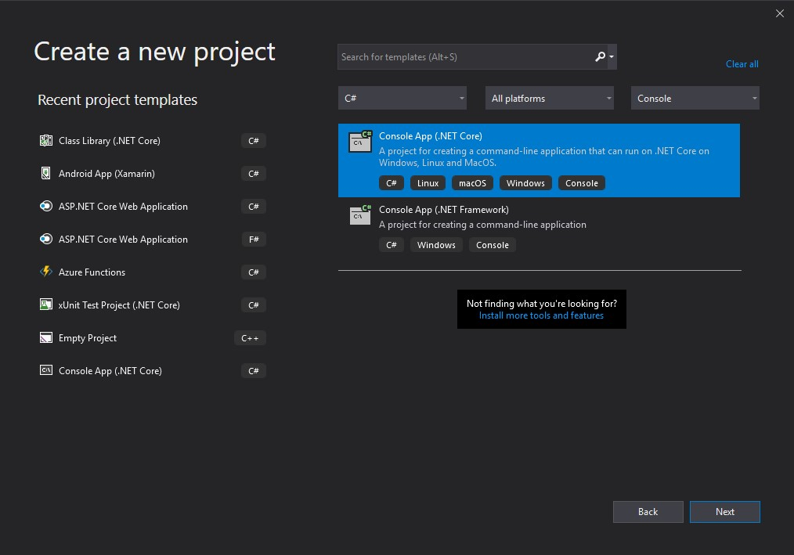

# Application avec Plugin

AssemblyLoadContext est la classe de base à utiliser pour l'utilisation de plugin. Pour pouvoir utiliser le Unload, il faut appeler le constructeur avec un boolean:<br>
```protected AssemblyLoadContext(bool isCollectible)```

Où isCollectible, lorsque mis à `True` permet de unloader l'assembly.

# Création du projet dans Visual Studio

Créer une application console du nom de AppWithPlugin.



## Creation du AssemblyLoadContext

```
using System;
using System.Reflection;
using System.Runtime.Loader;

namespace AppWithPlugin
{
    public class PluginLoadContext : AssemblyLoadContext
    {
        private readonly AssemblyDependencyResolver _resolver;

        public PluginLoadContext(string pluginPath) : base(true)
        {
            _resolver = new AssemblyDependencyResolver(pluginPath);
        }

        protected override Assembly Load(AssemblyName assemblyName)
        {
            string assemblyPath = _resolver.ResolveAssemblyToPath(assemblyName);
            if (assemblyPath != null)
            {
                return LoadFromAssemblyPath(assemblyPath);
            }

            return null;
        }

        protected override IntPtr LoadUnmanagedDll(string unmanagedDllName)
        {
            string libraryPath = _resolver.ResolveUnmanagedDllToPath(unmanagedDllName);
            if (libraryPath != null)
            {
                return LoadUnmanagedDllFromPath(libraryPath);
            }

            return IntPtr.Zero;
        }
    }
}
```

# Création de l'interface
Afin de pouvoir identifier un assembly comme étant un 

```
namespace PluginBase
{
    public interface ICommand
    {
        string Name { get; }
        string Description { get; }

        int Execute();
    }
}
```

# Création d'un plugin simple sans dépendances
Pour qu'un plugin soit détecté, il suffit d'implémenter l'interface préalablement créée `ICommand`. Il faut ajouter une référence à la librairie PluginBase en modifiant le fichier `.csproj`

```
 <ItemGroup>
    <ProjectReference Include="..\PluginBase\PluginBase.csproj">
      <Private>false</Private>
      <ExcludeAssets>runtime</ExcludeAssets>
    </ProjectReference>
  </ItemGroup>
```
Il faut faire cette étape pour s'assurer que la DLL n'est pas copiée dans le répertoire de compilation. Si la DLL est présente dans ce répertoire, elle sera chargée en double, car l'application de base l'utilise aussi. Il y aura alors une incompatibilité, car deux versions seront présentes.

```
using System;
using PluginBase;

namespace HelloPlugin
{
    public class HelloCommand : ICommand
    {
        public string Name => "hello";
        public string Description => "Hello World!";

        public int Execute()
        {
            Console.WriteLine(Description);
            return 0;
        }
    }
}
```
# Création d'un plugin avec dépendances

Nous allons maintenant créer un plugin qui comporte une référence à la librairie Newtonsoft Json.

Encore une fois
```
<ItemGroup>
    <PackageReference Include="Newtonsoft.Json" Version="12.0.3"/>
</ItemGroup>

<ItemGroup>
    <ProjectReference Include="..\PluginBase\PluginBase.csproj">
        <Private>false</Private>
        <ExcludeAssets>runtime</ExcludeAssets>
    </ProjectReference>
</ItemGroup>
```
La classe du plugin ressemblera à:
```
using System;
using System.Reflection;
using Newtonsoft.Json;
using PluginBase;

namespace JsonPlugin
{
    public class JsonPlugin : ICommand
    {
        public string Name => "json";

        public string Description => "Outputs JSON value.";

        private struct Info
        {
            public string JsonVersion;
            public string JsonLocation;
            public string Machine;
            public string User;
            public DateTime Date;
        }

        public int Execute()
        {
            Assembly jsonAssembly = typeof(JsonConvert).Assembly;
            Info info = new Info()
            {
                JsonVersion = jsonAssembly.FullName,
                JsonLocation = jsonAssembly.Location,
                Machine = Environment.MachineName,
                User = Environment.UserName,
                Date = DateTime.Now
            };

            Console.WriteLine(JsonConvert.SerializeObject(info, Formatting.Indented));

            return 0;
        }
    }
}
```
Pour compiler le plugin et s'assurer que la dépendance est disponible, il faut faire un publish de la façon suivante:

`dotnet publish`

Si la commande indique que le SDK n'est pas trouvable, veuillez ajouter la variable d'environnement `MSBuildSDKsPath` qui pointe sur l'emplacement du SDK (par exemple `C:\Program Files\dotnet\sdk\3.1.202\Sdks`).

# Création de l'application
Dans le fichier Program.cs du projet AppWithPlugin, mettre le code suivant:

```
using System;
using System.Collections.Generic;
using System.IO;
using System.Linq;
using System.Reflection;
using System.Runtime.CompilerServices;
using PluginBase;

namespace AppWithPlugin
{
    class Program
    {
        static void Main(string[] args)
        {
            try
            {
                if (args.Length == 1 && args[0] == "/d")
                {
                    Console.WriteLine("Waiting for any key...");
                    Console.ReadLine();
                }

                string[] pluginPaths =
                {
                    @"HelloPlugin\bin\Debug\netcoreapp3.1\HelloPlugin.dll",
                    @"JsonPlugin\bin\Debug\netcoreapp3.1\JsonPlugin.dll"
                };

                foreach (var pluginPath in pluginPaths)
                {
                    ExecuteAndUnload(pluginPath, out var assemblyContextWeakReference);

                    for (int i = 0; assemblyContextWeakReference.IsAlive && (i < 10); i++)
                    {
                        GC.Collect();
                        GC.WaitForPendingFinalizers();
                    }
                }

                Console.WriteLine("Press any key!");
                Console.ReadKey();
            }
            catch (Exception ex)
            {
                Console.WriteLine(ex);
            }
        }

        [MethodImpl(MethodImplOptions.NoInlining)]
        static void ExecuteAndUnload(string assemblyPath, out WeakReference alcWeakRef)
        {
            var pluginPath = GetPluginPath(assemblyPath);
            var alc = new PluginLoadContext(pluginPath);
            Assembly a = alc.LoadFromAssemblyPath(pluginPath);

            alcWeakRef = new WeakReference(alc, trackResurrection: true);

            var types = a.GetTypes();

            var instance = (ICommand) Activator.CreateInstance(a.GetType(types[0].FullName));
            
            var result = instance?.Execute();

            Console.WriteLine($"Result: {result}");

            alc.Unload();
        }

        static string GetPluginPath(string relativePath)
        {
            // Navigate up to the solution root
            string root = Path.GetFullPath(Path.Combine(
                Path.GetDirectoryName(
                    Path.GetDirectoryName(
                        Path.GetDirectoryName(
                            Path.GetDirectoryName(
                                Path.GetDirectoryName(typeof(Program).Assembly.Location)))))));

            return Path.GetFullPath(Path.Combine(root, relativePath.Replace('\\', Path.DirectorySeparatorChar)));
        }

        static IEnumerable<ICommand> CreateCommands(Assembly assembly)
        {
            int count = 0;

            foreach (Type type in assembly.GetTypes())
            {
                if (typeof(ICommand).IsAssignableFrom(type))
                {
                    if (Activator.CreateInstance(type) is ICommand result)
                    {
                        count++;
                        yield return result;
                    }
                }
            }

            if (count == 0)
            {
                string availableTypes = string.Join(",", assembly.GetTypes().Select(t => t.FullName));
                throw new ApplicationException(
                    $"Can't find any type which implements ICommand in {assembly} from {assembly.Location}.\n" +
                    $"Available types: {availableTypes}");
            }
        }
    }
}

```
