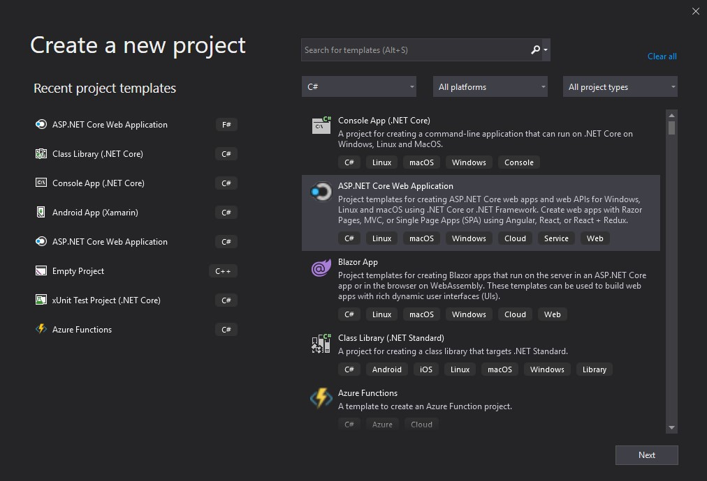
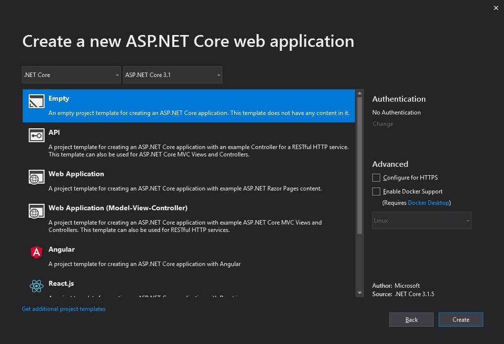

# Injection de dépendances
.Net Core supporte l'injection de dépendance (design pattern) qui est une technique pour parvenir à l'inversion de contrôle entre les classes et leurs dépendances.

# Survol de l'injection de dépendance
Une dépendance est un objet qu'un autre objet requiert.

```
public class MyDependency
{
    public MyDependency()
    {
    }

    public Task WriteMessage(string message)
    {
        Console.WriteLine(
            $"MyDependency.WriteMessage called. Message: {message}");

        return Task.FromResult(0);
    }
}
```

Une instance de MyDependency peut être créée pour rendre la méthode WriteMessage disponible à la classe:
```
public class IndexModel : PageModel
{
    MyDependency _dependency = new MyDependency();

    public async Task OnGetAsync()
    {
        await _dependency.WriteMessage(
            "IndexModel.OnGetAsync created this message.");
    }
}
```

La classe IndexModel crée et dépend directement de l'instance MyDependency. Ce type de dépendance est problématique et devrait être évité pour les raisons suivantes:
- Pour remplacer MyDependency avec une différente implémentation, la classe doit être modifiée.
- Si MyDependency a des dépendances, elles doivent être configurées par la classe. Dans une gros projet avec plusieurs classes qui dépendent sur MyDependency, la configuration devient éparpillée dans l'application.
- Cette implémentation est difficile à tester unitairement. L'application devrait utiliser un mock ou stubber la classe MyDependency, ce qui n'est pas possible avec cette approche.

L'injection de dépendance addresse ces problèmes grâce à :
- L'utilisation d'une interface ou d'une classe de base pour abstraire l'implémentation de la dépendance.
- L'enregistrement de la dépendance dans un service container.
- L'injection de service dans le constructeur d'une classe où elle est utilisée.

On obtient donc:
```
public interface IMyDependency
{
    Task WriteMessage(string message);
}
```

```
public class MyDependency : IMyDependency
{
    private readonly ILogger<MyDependency> _logger;

    public MyDependency(ILogger<MyDependency> logger)
    {
        _logger = logger;
    }

    public Task WriteMessage(string message)
    {
        _logger.LogInformation(
            "MyDependency.WriteMessage called. Message: {MESSAGE}", 
            message);

        return Task.FromResult(0);
    }
}
```

Pour l'ajouter au service container, il suffit d'ajouter la ligne suivante dans la méthode ConfigureServices de la classe Startup:
```
services.AddSingleton(typeof(ILogger<>), typeof(Logger<>));
```

# Durée de vie des services
Trois types de durée de vie sont disponibles:

## Transient
Un service de durée Transient est créé à chaque fois que ce dernier est sollicité du service container. C'est l'idéal pour les petits services qui sont stateless.

## Scoped
Un service de durée Scoped est créé une fois par requête du client (par connexion).

*** ATTENTION ***<BR>
Quand vous utilisez un service Scoped, il faut injecter le service par la méthode Invoke ou InvokeAsync. Ne pas injecter par le constructeur parce que cela force le service à agir comme un singleton.

## Singleton
Un service de durée Singleton est créé la première fois qu'il est sollicité. Toutes les utilisation subséquentes utilisent la même instance.

*** ATTENTION ***<BR>
Il est dangereux de résoudre un service Scoped dans un Singleton. Cela peut faire en sorte que le service aura un état incorrect lors des appels subséquents.

# Projet
## Création de l'application
Créer une application de type ASP<i></i>.Net Core Web Application nommé `MyApplication`.



Sélectionner Empty comme type de projet et décocher HTTPS et Docker.


## Création des interfaces
- Créer l'interface IMyDependency tel que vu précédemment.
- Créer l'interface IOperation qui contient une propriété OperationId qui est un Guid.
- Créer un interface pour chaque type de longévité (Scoped, Singleton, Transient) et un pour un SingletonInstance. Tous dérivent de IOperation.

## Création d'un modèle
- Créer le modèle Opération qui dérive de tous les interfaces d'opération créé précédemment et initialiser la valeur de OperationId à un nouveau Guid.

## Création des pages
Utiliser le code suivant:
_Layout.cshtml
```
<!DOCTYPE html>
<html lang="en">
<head>
    <meta charset="utf-8">
    <meta name="viewport" content="width=device-width, initial-scale=1.0">
    <title>@ViewData["Title"]</title>
    <style>
        body {
            margin: 0;
            padding-bottom: 20px;
            font-family: "Helvetica Neue", Helvetica, Arial, sans-serif;
            font-size: 14px;
            line-height: 1.42857143;
            color: #333;
            background-color: #fff;
        }

        h1 {
            font-size: 24px;
            margin: .67em 0;
        }

        pre {
            overflow: auto;
        }

        code, pre {
            font-family: monospace, monospace;
            font-size: 1em;
        }

        button, input {
            margin: 0;
            font: inherit;
            color: inherit;
        }

        button {
            overflow: visible;
        }

        button {
            text-transform: none;
        }

        input {
            line-height: normal;
        }

        {
            box-sizing: border-box;
        }

        :before, *:after {
            box-sizing: border-box;
        }

        input, button {
            font-family: inherit;
            font-size: inherit;
            line-height: inherit;
        }

        a {
            color: #337ab7;
            text-decoration: none;
        }

        h1, h2, h3, h4 {
            font-family: inherit;
            font-weight: 500;
            line-height: 1.1;
            color: inherit;
            margin-top: 20px;
            margin-bottom: 10px;
        }

        h3 {
            font-size: 16px;
        }

        h4 {
            font-size: 18px;
        }

        p {
            margin: 0 0 10px;
        }

        ol {
            margin-top: 0;
            margin-bottom: 10px;
        }

        code, pre {
            font-family: Menlo, Monaco, Consolas, "Courier New", monospace;
        }

        code {
            padding: 2px 4px;
            font-size: 90%;
            color: #c7254e;
            background-color: #f9f2f4;
            border-radius: 4px;
        }

        pre {
            display: block;
            padding: 9.5px;
            margin: 0 0 10px;
            font-size: 13px;
            line-height: 1.42857143;
            color: #333;
            word-break: break-all;
            word-wrap: break-word;
            background-color: #f5f5f5;
            border: 1px solid #ccc;
            -radius: 4px;
        }

            pre code {
                padding: 0;
                font-size: inherit;
                color: inherit;
                white-space: pre-wrap;
                background-color: transparent;
                border-radius: 0;
            }

        .container {
            padding-right: 15px;
            padding-left: 15px;
            margin-right: auto;
            margin-left: auto;
        }

        .container {
            width: 800px;
        }

        .btn {
            display: inline-block;
            padding: 6px 12px;
            margin-bottom: 0;
            font-size: 14px;
            font-weight: normal;
            line-height: 1.42857143;
            text-align: center;
            white-space: nowrap;
            vertical-align: middle;
            background-image: none;
            border: 1px solid transparent;
            border-radius: 4px;
            ;
            color: #fff;
            background-color: green;
            border-color: gray;
            float: right
        }

        .panel {
            margin-bottom: 20px;
            background-color: #fff;
            border: 1px solid transparent;
            border-radius: 4px;
            box-shadow: 0 1px 1px rgba(0, 0, 0, .05);
        }

        .panel-body {
            padding: 15px;
        }

        .panel-heading {
            padding: 10px 15px;
            border-bottom: 1px solid transparent;
            border-top-left-radius: 3px;
            border-top-right-radius: 3px;
        }

        .panel-title {
            margin-top: 0;
            margin-bottom: 0;
            font-size: 16px;
            color: inherit;
        }

        .panel-default {
            border-color: #ddd;
        }

            .panel-default > .panel-heading {
                color: #333;
                background-color: #f5f5f5;
                border-color: #ddd;
            }

        .clearfix:before, .clearfix:after, .container:before, .container:after, .panel-body:before, .panel-body:after {
            display: table;
            content: " ";
        }

        .clearfix:after, .container:after, .panel-body:after {
            clear: both;
        }

        .body-content {
            padding-left: 15px;
            padding-right: 15px;
        }

        .panel-body {
            font-size: 16px;
        }
    </style>
</head>
<body>
    <div class="container body-content">
        @RenderBody()
    </div>
</body>
</html>
```

_ViewImports.cshtml
```
@using MyApplication
@using MyApplication.Models
@namespace MyApplication.Pages
@addTagHelper *, Microsoft.AspNetCore.Mvc.TagHelpers
```

_ViewStart.cshtml
```
@{
    Layout = "_Layout";
}
```

Error.cshtml
```
@page
@model ErrorModel
@{
    ViewData["Title"] = "Error";
}

<h1 class="text-danger">Error.</h1>
<h2 class="text-danger">An error occurred while processing your request.</h2>

@if (Model.ShowRequestId)
{
    <p>
        <strong>Request ID:</strong> <code>@Model.RequestId</code>
    </p>
}

<h3>Development Mode</h3>
<p>
    Swapping to the <strong>Development</strong> environment displays detailed information about the error that occurred.
</p>
<p>
    <strong>The Development environment shouldn't be enabled for deployed applications.</strong>
    It can result in displaying sensitive information from exceptions to end users.
    For local debugging, enable the <strong>Development</strong> environment by setting the <strong>ASPNETCORE_ENVIRONMENT</strong> environment variable to <strong>Development</strong>
    and restarting the app.
</p>
```

Error.cshtml.cs
```
using System.Diagnostics;
using Microsoft.AspNetCore.Mvc;
using Microsoft.AspNetCore.Mvc.RazorPages;

namespace MyApplication.Pages
{
    [ResponseCache(Duration = 0, Location = ResponseCacheLocation.None, NoStore = true)]
    public class ErrorModel : PageModel
    {
        public string RequestId { get; set; }

        public bool ShowRequestId => !string.IsNullOrEmpty(RequestId);

        public void OnGet()
        {
            RequestId = Activity.Current?.Id ?? HttpContext.TraceIdentifier;
        }
    }
}
```

Index.cshtml
```
@page
@model IndexModel
@{
    ViewData["Title"] = "Dependency Injection Sample";
}

<h1>@ViewData["Title"]</h1>

<div class="row">
    <div class="panel panel-default">
        <div class="panel-heading">
            <h2 class="panel-title">MyDependency</h2>
        </div>
        <div class="panel-body">
            <p>The <code>IndexModel</code> has called the <code>IMyDependency</code> implemention (<code>MyDependency</code>). The service's <code>WriteMessage</code> method was called with a message string that indicates the page called the method on the service. The <code>WriteMessage</code> method created a log entry with the message string.</p>
        </div>
    </div>
</div>

<div class="row">
    <div class="panel panel-default">
        <div class="panel-heading">
            <h2 class="panel-title">Operations</h2>
        </div>
        <div class="panel-body">
            <h3>Page Model Operations</h3>
            <dl>
                <dt>Transient</dt>
                <dd>@Model.TransientOperation.OperationId</dd>
                <dt>Scoped</dt>
                <dd>@Model.ScopedOperation.OperationId</dd>
                <dt>Singleton</dt>
                <dd>@Model.SingletonOperation.OperationId</dd>
                <dt>Instance</dt>
                <dd>@Model.SingletonInstanceOperation.OperationId</dd>
            </dl>
            <h3>OperationService Operations</h3>
            <dl>
                <dt>Transient</dt>
                <dd>@Model.OperationService.TransientOperation.OperationId</dd>
                <dt>Scoped</dt>
                <dd>@Model.OperationService.ScopedOperation.OperationId</dd>
                <dt>Singleton</dt>
                <dd>@Model.OperationService.SingletonOperation.OperationId</dd>
                <dt>Instance</dt>
                <dd>@Model.OperationService.SingletonInstanceOperation.OperationId</dd>
            </dl>
        </div>
    </div>
</div>
```

Index.cshtml.cs
```
using System.Threading.Tasks;
using Microsoft.AspNetCore.Mvc.RazorPages;
using MyApplication.Interfaces;
using MyApplication.Services;

namespace MyApplication.Pages
{
    public class IndexModel : PageModel
    {
        private readonly IMyDependency _myDependency;

        public IndexModel(
            IMyDependency myDependency, 
            OperationService operationService,
            IOperationTransient transientOperation,
            IOperationScoped scopedOperation,
            IOperationSingleton singletonOperation,
            IOperationSingletonInstance singletonInstanceOperation)
        {
            _myDependency = myDependency;
            OperationService = operationService;
            TransientOperation = transientOperation;
            ScopedOperation = scopedOperation;
            SingletonOperation = singletonOperation;
            SingletonInstanceOperation = singletonInstanceOperation;
        }

        public OperationService OperationService { get; }
        public IOperationTransient TransientOperation { get; }
        public IOperationScoped ScopedOperation { get; }
        public IOperationSingleton SingletonOperation { get; }
        public IOperationSingletonInstance SingletonInstanceOperation { get; }

        public async Task OnGetAsync()
        {
            await _myDependency.WriteMessage(
                "IndexModel.OnGetAsync created this message.");
        }
    }
}
```

## Création des services
- Créer un service MyDependency tel que vu précédemment.
- Créer un service OperationService qui injecte tous les IOperationXXX et qui utilise les propriété publique suivantes:
  ```
  public IOperationTransient TransientOperation { get; }
  public IOperationScoped ScopedOperation { get; }
  public IOperationSingleton SingletonOperation { get; }
  public IOperationSingletonInstance SingletonInstanceOperation { get; }
  ```

## Modification de la classe Startup
- Ajouter le modèle pour tous les types de longévités incluant le singleton instance.
- Ajouter le service OperationService comme un service Transient.
- Ajouter un logger de type ILogger.
- Dans ConfigureService, ajouter la ligne suivante: `services.AddRazorPages();`
- Dans Configure, ajouter le code suivant:
  ```
  app.UseEndpoints(endpoints =>
  {
      endpoints.MapRazorPages();
  });
  ```
  
# Référence
https://docs.microsoft.com/en-us/aspnet/core/fundamentals/dependency-injection?view=aspnetcore-3.1