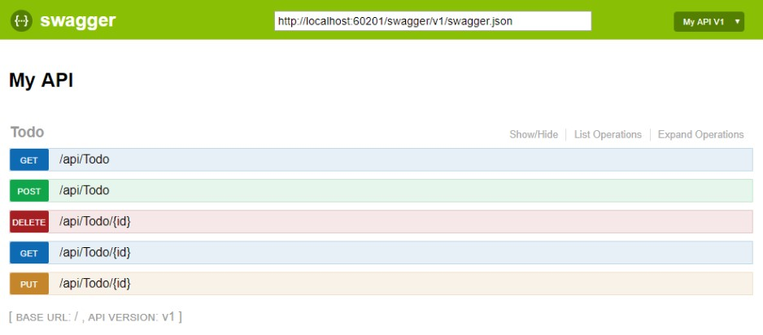

# Swagger
Swagger est un moyen de représenter la spécification d'un API REST. Le projet Swagger a été donné à l'initiative [OpenAPI](https://www.openapis.org/). Les deux noms sont utilisés, mais OpenAPI est à prévilégier.

# Spécification (swagger.json)
Swagger utilise un fichier swagger.json pour contenir la définition des spécification d'API. Ce fichier est généré par les outils de Swagger à partir du code. Ce fichier est aussi utilisé par le UI pour afficher les descriptions et permettre d'accéder au API pour faire des tests.

Voici un exemple de fichier:

```
{
   "swagger": "2.0",
   "info": {
       "version": "v1",
       "title": "API V1"
   },
   "basePath": "/",
   "paths": {
       "/api/Todo": {
           "get": {
               "tags": [
                   "Todo"
               ],
               "operationId": "ApiTodoGet",
               "consumes": [],
               "produces": [
                   "text/plain",
                   "application/json",
                   "text/json"
               ],
               "responses": {
                   "200": {
                       "description": "Success",
                       "schema": {
                           "type": "array",
                           "items": {
                               "$ref": "#/definitions/TodoItem"
                           }
                       }
                   }
                }
           },
           "post": {
               ...
           }
       },
       "/api/Todo/{id}": {
           "get": {
               ...
           },
           "put": {
               ...
           },
           "delete": {
               ...
   },
   "definitions": {
       "TodoItem": {
           "type": "object",
            "properties": {
                "id": {
                    "format": "int64",
                    "type": "integer"
                },
                "name": {
                    "type": "string"
                },
                "isComplete": {
                    "default": false,
                    "type": "boolean"
                }
            }
       }
   },
   "securityDefinitions": {}
}
```

# UI
Le UI permet de voir la documentation des différents API ainsi que l'interaction avec le serveur pour tester les appels.


# Swashbuckle pour Swagger
Trois composants principaux sont disponibles pour Swashbuckle:
- Swashbuckle.AspNetCore.Swagger
- Swashbuckle.AspNetCore.SwaggerGen
- Swashbuckle.AspNetCore.SwaggerUI

Il suffit d'installer les librairies à l'aide de Nuget.

Pour permettre l'utilisation de Swagger, il faut ajouter le code suivant au Startup:

```
using Microsoft.OpenApi.Models;
```

```
public void ConfigureServices(IServiceCollection services)
{
    services.AddDbContext<TodoContext>(opt =>
        opt.UseInMemoryDatabase("TodoList"));
    services.AddControllers();

    // Register the Swagger generator, defining 1 or more Swagger documents
    services.AddSwaggerGen(c =>
    {
        c.SwaggerDoc("v1", new OpenApiInfo { Title = "My API", Version = "v1" });
    });
}
```

```
public void Configure(IApplicationBuilder app)
{
    // Enable middleware to serve generated Swagger as a JSON endpoint.
    app.UseSwagger();

    // Enable middleware to serve swagger-ui (HTML, JS, CSS, etc.),
    // specifying the Swagger JSON endpoint.
    app.UseSwaggerUI(c =>
    {
        c.SwaggerEndpoint("/swagger/v1/swagger.json", "My API V1");
    });

    app.UseRouting();
    app.UseEndpoints(endpoints =>
    {
        endpoints.MapControllers();
    });
}
```

Il est possible de personnaliser la page de Swagger:
```
// Register the Swagger generator, defining 1 or more Swagger documents
services.AddSwaggerGen(c =>
{
    c.SwaggerDoc("v1", new OpenApiInfo
    {
        Version = "v1",
        Title = "ToDo API",
        Description = "A simple example ASP.NET Core Web API",
        TermsOfService = new Uri("https://example.com/terms"),
        Contact = new OpenApiContact
        {
            Name = "Shayne Boyer",
            Email = string.Empty,
            Url = new Uri("https://twitter.com/spboyer"),
        },
        License = new OpenApiLicense
        {
            Name = "Use under LICX",
            Url = new Uri("https://example.com/license"),
        }
    });
});
```

# Documenter son code
Pour faire la documentation des APIs, il suffit de mettre des commentaires sous formes XML. Il est possible de le faire de la façon suivante. Dans le fichier .csproj, ajouter les lignes suivantes:
```
<PropertyGroup>
  <GenerateDocumentationFile>true</GenerateDocumentationFile>
  <NoWarn>$(NoWarn);1591</NoWarn>
</PropertyGroup>
```

Lorsqu'activé, si un commentaire est omis, un warning sera généré à la compilation. Le \<NoWarm> est justement là pour empêcher ces warnings. Or, ceci sera appliqué à tout le projet. Si ce n'est pas l'effet désiré, il est possible de supprimer les warnings localement de la façon suivante:

```
namespace TodoApi
{
#pragma warning disable CS1591
    public class Program
    {
        public static void Main(string[] args) =>
            BuildWebHost(args).Run();

        public static IWebHost BuildWebHost(string[] args) =>
            WebHost.CreateDefaultBuilder(args)
                .UseStartup<Startup>()
                .Build();
    }
#pragma warning restore CS1591
}
```

Par la suite, on configure Swagger pour utiliser le fichier XML qui est généré par l'instruction ajoutée.
```
public void ConfigureServices(IServiceCollection services)
{
    services.AddDbContext<TodoContext>(opt =>
        opt.UseInMemoryDatabase("TodoList"));
    services.AddControllers();

    // Register the Swagger generator, defining 1 or more Swagger documents
    services.AddSwaggerGen(c =>
    {
        c.SwaggerDoc("v1", new OpenApiInfo
        {
            Version = "v1",
            Title = "ToDo API",
            Description = "A simple example ASP.NET Core Web API",
            TermsOfService = new Uri("https://example.com/terms"),
            Contact = new OpenApiContact
            {
                Name = "Shayne Boyer",
                Email = string.Empty,
                Url = new Uri("https://twitter.com/spboyer"),
            },
            License = new OpenApiLicense
            {
                Name = "Use under LICX",
                Url = new Uri("https://example.com/license"),
            }
        });

        // Set the comments path for the Swagger JSON and UI.
        var xmlFile = $"{Assembly.GetExecutingAssembly().GetName().Name}.xml";
        var xmlPath = Path.Combine(AppContext.BaseDirectory, xmlFile);
        c.IncludeXmlComments(xmlPath);
    });
}
```

Pour enrichir les descriptions, il est possible d'ajouter des commentaires avec des '///' dans un format XML.

```
/// <summary>
/// Creates a TodoItem.
/// </summary>
/// <remarks>
/// Sample request:
///
///     POST /Todo
///     {
///        "id": 1,
///        "name": "Item1",
///        "isComplete": true
///     }
///
/// </remarks>
/// <param name="item"></param>
/// <returns>A newly created TodoItem</returns>
/// <response code="201">Returns the newly created item</response>
/// <response code="400">If the item is null</response>            
[HttpPost]
[ProducesResponseType(StatusCodes.Status201Created)]
[ProducesResponseType(StatusCodes.Status400BadRequest)]
public ActionResult<TodoItem> Create(TodoItem item)
{
    _context.TodoItems.Add(item);
    _context.SaveChanges();

    return CreatedAtRoute("GetTodo", new { id = item.Id }, item);
}
```

Dans les models, si on ajoute des annotations tels `Required` et `DefaultValue`, elles seront indiquées dans la documentation de Swagger.

Il est aussi possible de documenter les réponses HTTP.
```
/// <summary>
/// Creates a TodoItem.
/// </summary>
/// <remarks>
/// Sample request:
///
///     POST /Todo
///     {
///        "id": 1,
///        "name": "Item1",
///        "isComplete": true
///     }
///
/// </remarks>
/// <param name="item"></param>
/// <returns>A newly created TodoItem</returns>
/// <response code="201">Returns the newly created item</response>
/// <response code="400">If the item is null</response>            
[HttpPost]
[ProducesResponseType(StatusCodes.Status201Created)]
[ProducesResponseType(StatusCodes.Status400BadRequest)]
public ActionResult<TodoItem> Create(TodoItem item)
{
    _context.TodoItems.Add(item);
    _context.SaveChanges();

    return CreatedAtRoute("GetTodo", new { id = item.Id }, item);
}
```

Il en est de même pour l'attribut `Produces`.

```
[Produces("application/json")]
[Route("api/[controller]")]
[ApiController]
public class TodoController : ControllerBase
{
    private readonly TodoContext _context;
```

# Références
- https://docs.microsoft.com/en-us/aspnet/core/tutorials/web-api-help-pages-using-swagger?view=aspnetcore-3.1
- https://docs.microsoft.com/en-us/aspnet/core/tutorials/getting-started-with-swashbuckle?view=aspnetcore-3.1&tabs=visual-studio