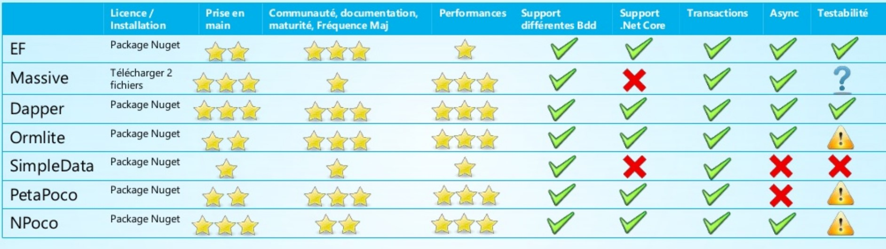

# EntityFramework Core
Entity Framework (EF) Core est une version cross-platform open-source, extensible et lightweigth de la technologie EntityFramework. Il peut servir comme ORM (object-relational mapper) permettant aux développeurs .NET de travailler avec une base de données en utilisant des objets .NET.

# Comparaison avec d'autres ORM

source: https://www.slideshare.net/MSDEVMTL/entity-framework-core-2-vs-micro-orm-performances

En comparaison avec les autres ORMs, Entity Framework est une solution complète alors que d'autres, comme NPoco sont considérés des micro-ORM. Le point faible d'Entity Framework est au niveau des performances, quoi qu'il s'améliore de version en version. Dapper est un des ORM les plus complet tant au niveau des fonctionnalités que des performances, ce qui en fait un des plus populaire.

# Models
EF Core permet l'accès aux données à l'aide de models. Un model est une classe et un contexte qui représentent une session avec la base de données permettant de faire des requêtes et sauvegarder des données.

Il est possible de générer un model à partir d'une base de données existante, en codant un model selon la base de données ou en utilisant les migrations pour créer la base de données à partir des models.

```
using Microsoft.EntityFrameworkCore;
using System.Collections.Generic;

namespace Intro
{
    public class BloggingContext : DbContext
    {
        public DbSet<Blog> Blogs { get; set; }
        public DbSet<Post> Posts { get; set; }

        protected override void OnConfiguring(DbContextOptionsBuilder optionsBuilder)
        {
            optionsBuilder.UseSqlServer(
                @"Server=(localdb)\mssqllocaldb;Database=Blogging;Integrated Security=True");
        }
    }

    public class Blog
    {
        public int BlogId { get; set; }
        public string Url { get; set; }
        public int Rating { get; set; }
        public List<Post> Posts { get; set; }
    }

    public class Post
    {
        public int PostId { get; set; }
        public string Title { get; set; }
        public string Content { get; set; }

        public int BlogId { get; set; }
        public Blog Blog { get; set; }
    }
}
```

# Requêtes
Il est possible d'utiliser LINQ (Language Integrated Query) pour faire des requêtes sur un contexte.

```
using (var db = new BloggingContext())
{
    var blogs = db.Blogs
        .Where(b => b.Rating > 3)
        .OrderBy(b => b.Url)
        .ToList();
}
```

# Ajout de données
Les données sont ajoutées, modifiées ou effacées en utilisant une instance du modèle.

```
using (var db = new BloggingContext())
{
    var blog = new Blog { Url = "http://sample.com" };
    db.Blogs.Add(blog);
    db.SaveChanges();
}
```

# Connection String
La connection string devrait se retrouver dans les secrets.

```
{
  "ConnectionStrings": {
    "BloggingDatabase": "Server=(localdb)\\mssqllocaldb;Database=EFGetStarted.ConsoleApp.NewDb;Trusted_Connection=True;"
  },
}
```

Pour configurer le context, il suffit de l'ajouter aux services dans le Startup:
```
public void ConfigureServices(IServiceCollection services)
{
    services.AddDbContext<BloggingContext>(options =>
        options.UseSqlServer(Configuration.GetConnectionString("BloggingDatabase")));
}
```

# Logging
EF Core s'intègre automatiquement avec le mécanisme de logging de .NET Core quand AddDbContext ou AddDbContextPool est utilisé.

# Résilience de la connexion
Il est possible de configurer EF Core pour faire des retry lorsqu'une commande échoue.

```
public void ConfigureServices(IServiceCollection services)
{
    services.AddDbContext<PicnicContext>(
        options => options.UseSqlServer(
            "<connection string>",
            providerOptions => providerOptions.EnableRetryOnFailure()));
}
```

# Créer un modèle
Deux moyens s'offrent à nous pour configurer un modèle:
- Fluent API
- Annotations

## Fluent API
```
using Microsoft.EntityFrameworkCore;

namespace EFModeling.FluentAPI.Required
{
    class MyContext : DbContext
    {
        public DbSet<Blog> Blogs { get; set; }

        #region Required
        protected override void OnModelCreating(ModelBuilder modelBuilder)
        {
            modelBuilder.Entity<Blog>()
                .Property(b => b.Url)
                .IsRequired();
        }
        #endregion
    }

    public class Blog
    {
        public int BlogId { get; set; }
        public string Url { get; set; }
    }
}
```

## Annotations
```
using Microsoft.EntityFrameworkCore;
using System.ComponentModel.DataAnnotations;

namespace EFModeling.DataAnnotations.Required
{
    class MyContext : DbContext
    {
        public DbSet<Blog> Blogs { get; set; }
    }

    #region Required
    public class Blog
    {
        public int BlogId { get; set; }
        [Required]
        public string Url { get; set; }
    }
    #endregion
}
```

## Propriétés d'une entité
### Inclusion/Exclusion
Une propriété est incluse par défaut, pour l'exclure, il faut utiliser l'annotation suivante:
```
public class Blog
{
    public int BlogId { get; set; }
    public string Url { get; set; }

    [NotMapped]
    public DateTime LoadedFromDatabase { get; set; }
}
```

Ou
```
protected override void OnModelCreating(ModelBuilder modelBuilder)
{
    modelBuilder.Entity<Blog>()
        .Ignore(b => b.LoadedFromDatabase);
}
```

### Nom de colonnes
```
public class Blog
{
    [Column("blog_id")]
    public int BlogId { get; set; }
    public string Url { get; set; }
}
```

ou

```
protected override void OnModelCreating(ModelBuilder modelBuilder)
{
    modelBuilder.Entity<Blog>()
        .Property(b => b.BlogId)
        .HasColumnName("blog_id");
}
```

### Type de données
```
public class Blog
{
    public int BlogId { get; set; }
    [Column(TypeName = "varchar(200)")]
    public string Url { get; set; }
    [Column(TypeName = "decimal(5, 2)")]
    public decimal Rating { get; set; }
}
```

ou

```
protected override void OnModelCreating(ModelBuilder modelBuilder)
{
    modelBuilder.Entity<Blog>(eb =>
    {
        eb.Property(b => b.Url).HasColumnType("varchar(200)");
        eb.Property(b => b.Rating).HasColumnType("decimal(5, 2)");
    });
}
```

### Longueur Maximum
```
public class Blog
{
    public int BlogId { get; set; }
    [MaxLength(500)]
    public string Url { get; set; }
}
```

ou

```
protected override void OnModelCreating(ModelBuilder modelBuilder)
{
    modelBuilder.Entity<Blog>()
        .Property(b => b.Url)
        .HasMaxLength(500);
}
```

### Champs requis ou non
```
public class CustomerWithoutNullableReferenceTypes
{
    public int Id { get; set; }
    [Required]                               // Data annotations needed to configure as required
    public string FirstName { get; set; }    
    [Required]
    public string LastName { get; set; }     // Data annotations needed to configure as required
    public string MiddleName { get; set; }   // Optional by convention
}
```

ou

```
public class Customer
{
    public int Id { get; set; }
    public string FirstName { get; set; }    // Required by convention
    public string LastName { get; set; }     // Required by convention
    public string? MiddleName { get; set; }  // Optional by convention

    public Customer(string firstName, string lastName, string? middleName = null)
    {
        FirstName = firstName;
        LastName = lastName;
        MiddleName = middleName;
    }
}
```

## Clés
Pour définir les clés, encore une fois, les deux méthodes sont disponibles:
```
class Car
{
    [Key]
    public string LicensePlate { get; set; }

    public string Make { get; set; }
    public string Model { get; set; }
}
```

ou

```
protected override void OnModelCreating(ModelBuilder modelBuilder)
{
    modelBuilder.Entity<Car>()
        .HasKey(c => c.LicensePlate);
}
```

Les clés composées cependant ne peuvent être crées que par le Fluent API:
```
protected override void OnModelCreating(ModelBuilder modelBuilder)
{
    modelBuilder.Entity<Car>()
        .HasKey(c => new { c.State, c.LicensePlate });
}
```

Pour nommer une clé primaire:
```
protected override void OnModelCreating(ModelBuilder modelBuilder)
{
    modelBuilder.Entity<Blog>()
        .HasKey(b => b.BlogId)
        .HasName("PrimaryKey_BlogId");
}
```

Voir la référence pour plus de fonctionalités.

# Database first
Lorsque la base de données est déjà existante, il est possible de générer les models à partir de celle-ci. Pour ce faire, il faut utiliser le Package Manager Console tools.

```
Scaffold-DbContext "Server=...;Database=SchoolDB;Trusted_Connection=True;" Microsoft.EntityFrameworkCore.SqlServer -OutputDir Models
```

Cette commande va créer les classes seulement pour les tables et non pour les StoredProcedure ou les vues. La classe DBContext sera aussi générée.

# Code first ou Migrations
Il est possible de générer directement les tables de base de données à partir des classes d'entités. Ceci est fait avec les migrations.

Pour créer des migrations, il faut utiliser le Package Manager Console tools.

```
Add-Migration InitialCreate
```

Par la suite, on update la base de données:
```
Update-Database
```
# Références
https://docs.microsoft.com/en-us/ef/core/
