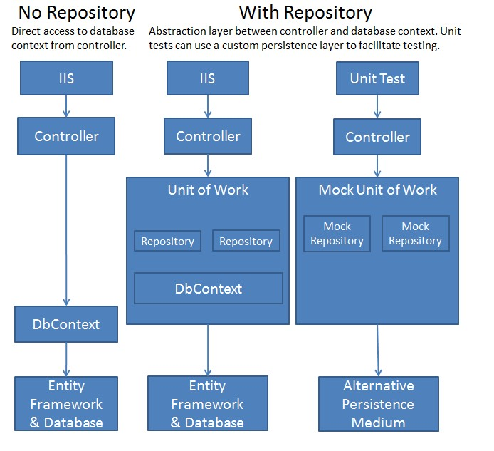

# UnitOfWork et Repository pattern
Les patterns UnitOfWork et Repository sont très populaires et utilisés pour gérer les requêtes sur une base de données.

L'avantage principal de l'utilisation de ce patron est l'encapsulation du DbContext, ce qui permet de "mocker" les accès à la base de données. Il est donc beaucoup plus facile de faire des tests unitaires sans avoir à accéder directement à la base de données.


source: https://docs.microsoft.com/en-us/aspnet/mvc/overview/older-versions/getting-started-with-ef-5-using-mvc-4/implementing-the-repository-and-unit-of-work-patterns-in-an-asp-net-mvc-application

Le repository abstrait l'accès à la base de données pour une entité donnée. Vu que les manipulations des tables est relativement semblables en général, il est intéressant de créer un repository générique:

```
public interface IRepository<T> where T : class
    {
        IEnumerable<T> GetAll();

        int Count(Expression<Func<T, bool>> predicate = null);
        
        T GetById(object id);

        IEnumerable<T> Get(
            Expression<Func<T, bool>> filter = null,
            Func<IQueryable<T>, IOrderedQueryable<T>> orderBy = null,
            string includeProperties = "",
            bool asNoTracking = true);

        Task InsertAsync(T entity, CancellationToken cancellationToken = default(CancellationToken));

        void Update(T entity);

        void Delete(T entity);

        void DeleteById(object id);
    }
```

Pour une implémentation avec EntityFramework, nous obtenons donc:

```
public class GenericRepository<T>: IRepository<T> where T : class
    {
        private readonly DbContext _context;
        private readonly DbSet<T> _dbSet;

        public GenericRepository(DbContext context)
        {
            _context = context;
            _dbSet = context.Set<T>();
        }

        public int Count(Expression<Func<T, bool>> predicate = null)
        {
            if (predicate == null)
            {
                return _dbSet.Count();
            }

            return _dbSet.Count(predicate);
        }

        public IEnumerable<T> Get(
            Expression<Func<T, bool>> filter = null,
            Func<IQueryable<T>, IOrderedQueryable<T>> orderBy = null,
            string includeProperties = "",
            bool asNoTracking = true)
        {
            IQueryable<T> query = asNoTracking ?_dbSet.AsNoTracking() : _dbSet;

            if (filter != null)
            {
                query = query.Where(filter);
            }

            foreach (var includeProperty in includeProperties.Split
                (new[] { ',' }, StringSplitOptions.RemoveEmptyEntries))
            {
                query = query.Include(includeProperty);
            }

            if (orderBy != null)
            {
                return orderBy(query);
            }

            return query;
        }

        public IEnumerable<T> GetAll()
        {
            return _dbSet.AsNoTracking();
        }

        public virtual T GetById(object id)
        {
            var result =  _dbSet.Find(id);
            _context.Entry(result).State = EntityState.Detached;
            return result;
        }

        public async Task InsertAsync(T entity, CancellationToken cancellationToken = default(CancellationToken))
        {
            await _dbSet.AddAsync(entity, cancellationToken);
        }

        public virtual void DeleteById(object id)
        {
            T entityToDelete = _dbSet.Find(id);
            Delete(entityToDelete);
        }

        public virtual void Delete(T entityToDelete)
        {
            if (_context.Entry(entityToDelete).State == EntityState.Detached)
            {
                _dbSet.Attach(entityToDelete);
            }
            _dbSet.Remove(entityToDelete);
        }

        public virtual void Update(T entityToUpdate)
        {
            _dbSet.Attach(entityToUpdate);
            _context.Entry(entityToUpdate).State = EntityState.Modified;
        }
    }
```

Le Unit of Work encapsule les repository d'une application. Il sert à gérer les transactions et peut aussi être utilisé pour lancer des commandes SQL plus complexes qui seraient compliquées à faire à l'aide de l'ORM.

Voici donc ce à quoi ressemblerait un Unit of Work:
```
public interface IUnitOfWork : IDisposable
    {
        IRepository<TEntity> GetRepository<TEntity>() where TEntity : class;
        DbContext GetContext();
        int SaveChanges();
        Task<int> SaveChangesAsync();

        int ExecuteSqlCommand(string sql, params object[] parameters);
        IQueryable<TEntity> FromSql<TEntity>(string sql, params object[] parameters) where TEntity : class;

    }
```

L'accès au repository se fait par le Unit of Work seulement. Nous avons donc seulement cette dépendance à ajouter au dependency injection.

Lorsqu'on fait des tests, il est donc possible de faire en sorte que la fonction GetRepository retourne une version mock du repository, ce qui nous donne la flexibilité de simuler les accès à la base de données.