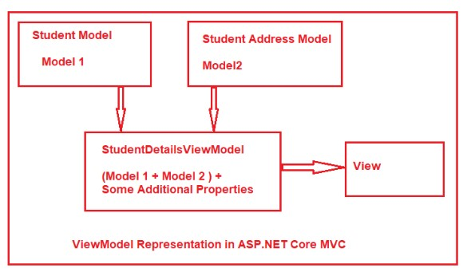

# ViewModels
Parfois une application a besoin de l'information provenant de plusieurs modèles:
<BR>
source: https://dotnettutorials.net/lesson/view-model-asp-net-core-mvc/

Pour être en mesure de retourner cette information, un moyen courament utilisé est le view model.

```
public class User
{
    public int Id { get; set; }
    public string FirstName { get; set; }
    public string LastName { get; set; }
    public string Email { get; set; }
    public string Gender { get; set; }
}
```

```
public class Address
{
    public int UserId { get; set; }
    public string City { get; set; }
    public string State { get; set; }
    public string Country { get; set; }
    public string Pin { get; set; }
}
```

Nous pouvons donc utiliser le viewmodel suivant:
```
public class StudentDetailsViewModel
{
    public Student Student { get; set; }
    public Address Address { get; set; }
    public string Title { get; set; }
    public string Header { get; set; }
}
```

# Validation
Il est possible d'ajouter de la validation pour s'assurer de l'integrité du viewmodel. Voici un exemple de validations:

```
public class Movie
{
    public int Id { get; set; }

    [Required]
    [StringLength(100)]
    public string Title { get; set; }

    [ClassicMovie(1960)]
    [DataType(DataType.Date)]
    [Display(Name = "Release Date")]
    public DateTime ReleaseDate { get; set; }

    [Required]
    [StringLength(1000)]
    public string Description { get; set; }

    [Range(0, 999.99)]
    public decimal Price { get; set; }

    public Genre Genre { get; set; }

    public bool Preorder { get; set; }
}
```
Dans cet exemple, l'attribut ClassicMovie est un attribut personnalisé.

Voici quelques exemples d'attributs disponibles.
- [CreditCard]: Validates that the property has a credit card format. 
- [Compare]: Validates that two properties in a model match.
- [EmailAddress]: Validates that the property has an email format.
- [Phone]: Validates that the property has a telephone number format.
- [Range]: Validates that the property value falls within a specified range.
- [RegularExpression]: Validates that the property value matches a specified regular expression.
- [Required]: Validates that the field is not null. See [Required] attribute for details about this attribute's behavior.
- [StringLength]: Validates that a string property value doesn't exceed a specified length limit.
- [Url]: Validates that the property has a URL format.
- [Remote]: Validates input on the client by calling an action method on the server. See [Remote] attribute for details about this attribute's behavior.

# Messages d'erreur
Il est possible d'indiquer un message d'erreur dans le cas où une validation échoue.

```
[StringLength(8, ErrorMessage = "Name length can't be more than 8.")]
```

Il est aussi possible de formatter le message.
```
[StringLength(8, ErrorMessage = "{0} length must be between {2} and {1}.", MinimumLength = 6)]
```
Dans ce cas-ci, si la propriété s'appelle Name, nous obtenons le message '`Name length must be between 6 and 8`'.

# Attributs personnalisés
Il est possible de créer des validateur personnalisés.

```
public class ClassicMovieAttribute : ValidationAttribute
{
    public ClassicMovieAttribute(int year)
    {
        Year = year;
    }

    public int Year { get; }

    public string GetErrorMessage() =>
        $"Classic movies must have a release year no later than {Year}.";

    protected override ValidationResult IsValid(object value,
        ValidationContext validationContext)
    {
        var movie = (Movie)validationContext.ObjectInstance;
        var releaseYear = ((DateTime)value).Year;

        if (movie.Genre == Genre.Classic && releaseYear > Year)
        {
            return new ValidationResult(GetErrorMessage());
        }

        return ValidationResult.Success;
    }
}
```

L'exemple précédent ne fonctionne qu'avec des objets de type Movie. Si nous voulons étendre cette fonctionnalité, nous pouvons utiliser l'interface `IValidatableObject`.

```
public class ValidatableMovie : IValidatableObject
{
    private const int _classicYear = 1960;

    public int Id { get; set; }

    [Required]
    [StringLength(100)]
    public string Title { get; set; }

    [DataType(DataType.Date)]
    [Display(Name = "Release Date")]
    public DateTime ReleaseDate { get; set; }

    [Required]
    [StringLength(1000)]
    public string Description { get; set; }

    [Range(0, 999.99)]
    public decimal Price { get; set; }

    public Genre Genre { get; set; }

    public bool Preorder { get; set; }

    public IEnumerable<ValidationResult> Validate(ValidationContext validationContext)
    {
        if (Genre == Genre.Classic && ReleaseDate.Year > _classicYear)
        {
            yield return new ValidationResult(
                $"Classic movies must have a release year no later than {_classicYear}.",
                new[] { nameof(ReleaseDate) });
        }
    }
}
```

Pour exécuter la validation, il faut appeler le ModelState:
```
if (!ModelState.IsValid)
{
    var errors = from error in ModelState
                    where error.Value.Errors.Any()
                    from err in error.Value.Errors
                        select String.IsNullOrWhiteSpace(err.ErrorMessage) ? err.Exception.Message : err.ErrorMessage;
    return Json(errors);
}
```