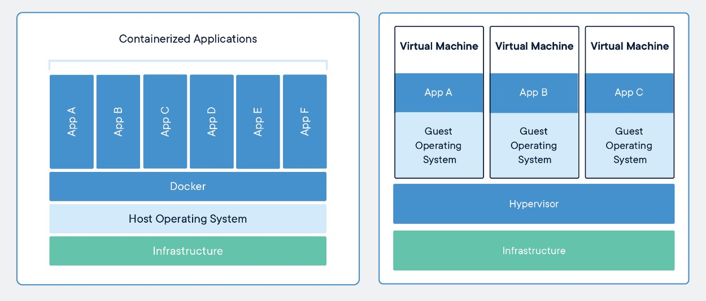
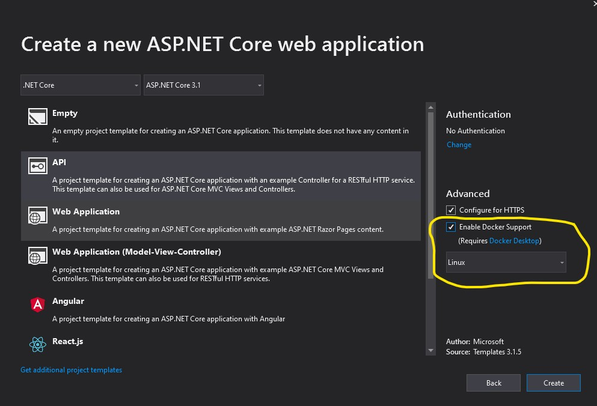
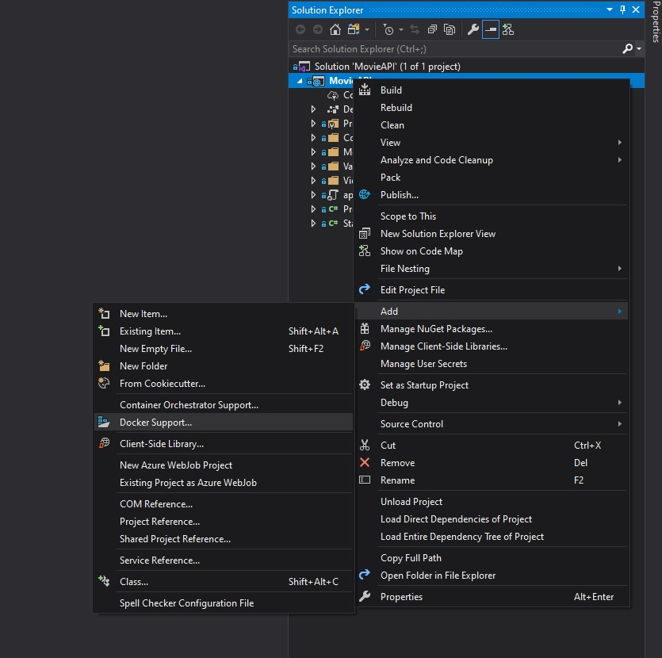
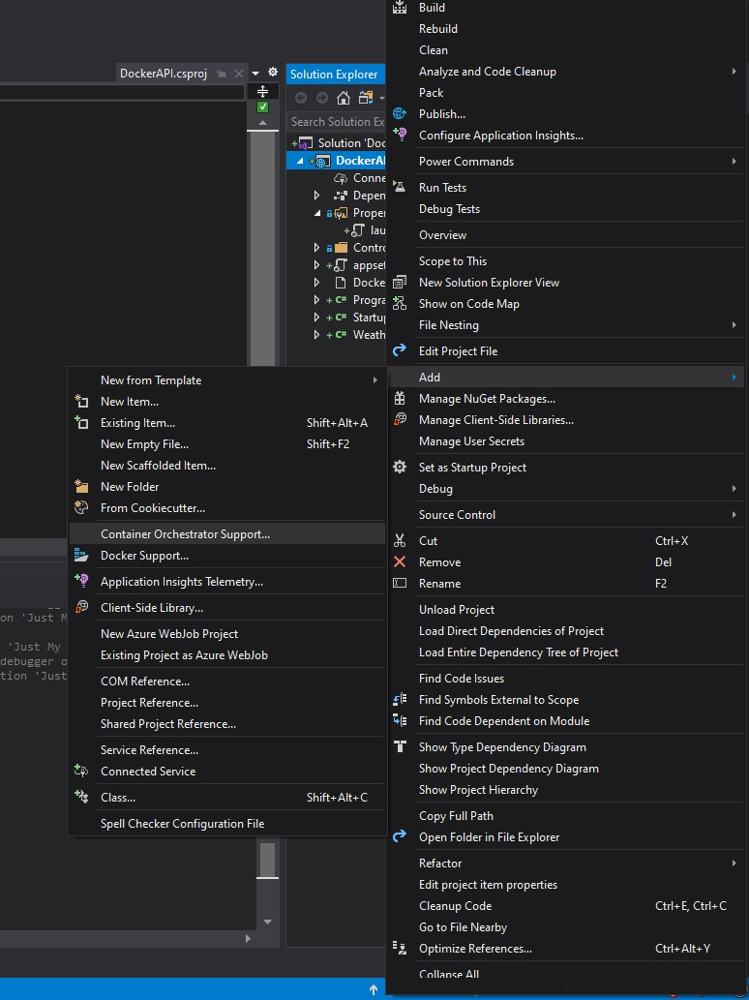
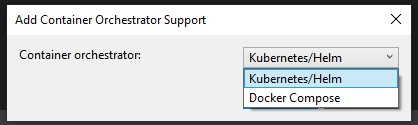

# Container
Qu'est-ce qu'un container? Quelle est la différence avec une machine virtuelle? Le graphique suivant représente très bien les différences.


source: https://www.docker.com/resources/what-container

Un container représente une abstraction au niveau de l'application qui englobe le code et ses dépendances. Plusieurs containers peuvent rouler sur la même machine et partagent le même OS. Ceci fait en sorte que l'empreinte d'un container est beaucoup plus petit que celui d'une machine virtuelle.

# .Net Core et Docker
Il est possible de créer un déploiement Docker directement à partir de Visual Studio. Il suffit de sélectionner l'option `Enable Docker Support` et de sélectionner le type de déploiement (Linux ou Windows).



Il est à noter que le support de Windows est généralement moins bon que celui de Linux, donc il est préférable de développer en Linux. Or, avec .Net Core, ça ne fait aucune différence, car le code est portable.

Si toutefois vous avez un projet existant et désirez ajouter le support de Docker, c'est possible. Il suffit d'ajouter le support Docker par le menu.



Dans les deux cas, un Dockerfile sera créé et le target Docker sera ajouté au launchSettings.json.

```
#See https://aka.ms/containerfastmode to understand how Visual Studio uses this Dockerfile to build your images for faster debugging.

FROM mcr.microsoft.com/dotnet/core/aspnet:3.1-buster-slim AS base
WORKDIR /app
EXPOSE 80
EXPOSE 443

FROM mcr.microsoft.com/dotnet/core/sdk:3.1-buster AS build
WORKDIR /src
COPY ["DockerAPI.csproj", "DockerAPI/"]
RUN dotnet restore "DockerAPI/DockerAPI.csproj"
COPY . ./DockerAPI
RUN ls
WORKDIR /src/DockerAPI
RUN dotnet build "DockerAPI.csproj" -c Release -o /app/build

FROM build AS publish
RUN dotnet publish "DockerAPI.csproj" -c Release -o /app/publish

FROM base AS final
WORKDIR /app
COPY --from=publish /app/publish .
ENTRYPOINT ["dotnet", "DockerAPI.dll"]
```

Regardons ce fichier de plus prêt.

```
FROM mcr.microsoft.com/dotnet/core/aspnet:3.1-buster-slim AS base
WORKDIR /app
EXPOSE 80
EXPOSE 443
```

La première ligne va télécharger l'environnement aspnetcore et on y assigne l'alias base.

Par la suite, on indique au container que le répertoire courant est maintenant /app.

Finalement on expose les ports 80 et 443 pour qu'ils soient accessibles de l'extérieur.

```
FROM mcr.microsoft.com/dotnet/core/sdk:3.1-buster AS build
WORKDIR /src
COPY ["DockerAPI.csproj", "DockerAPI/"]
RUN dotnet restore "DockerAPI/DockerAPI.csproj"
COPY . ./DockerAPI
WORKDIR /src/DockerAPI
RUN dotnet build "DockerAPI.csproj" -c Release -o /app/build
```

Ici, nous téléchargeons le SDK et l'associons à l'alias build. Le répertoire courant est changé pour /src. Nous copions le projet sur le container et faisons un restore sur ce projet. Il est à noter que si vous utilisez une autres localisation que le nuget par défaut, certaines modifications sont nécessaires. Nous allons les voir plus tard.

Ensuite, nous copions le code au complet sur le container et on change le répertoire courant pour /src/DockerAPI. Finalement, nous lançons la commande build. Le résultat sera mis dans /app/build.

```
FROM build AS publish
RUN dotnet publish "DockerAPI.csproj" -c Release -o /app/publish
```

Dans cette étable, nous utilisons le même SDK que l'étape précédente et ajoutons l'alias publish. Nous faisons par la suite la publication du code. Le répertoire de sortie sera /app/publish.

```
FROM base AS final
WORKDIR /app
COPY --from=publish /app/publish .
ENTRYPOINT ["dotnet", "DockerAPI.dll"]
```

Finalement, la dernière étape. Nous prenons l'environnement de base et la nommons final. Nous changeons le répertoire courant pour /app et copions le contenu de app/publish de l'étape Publish dans le répertoire courant.

La dernière ligne indique comment le container doit démarrer l'application. La commande dotnet sera exécutée avec la dll en argument.

# Utiliser une source Nuget privée
Pour utiliser un Nuget privé, certaines modifications sont nécessaires.

Premièrement, il faut ajouter un nuget.config à notre projet.

```
<?xml version="1.0" encoding="UTF-8"?>
<configuration>
    <!-- defaultPushSource key works like the 'defaultPushSource' key of NuGet.Config files. -->
    <!-- This can be used by administrators to prevent accidental publishing of packages to nuget.org. -->
    <config>
        <add key="defaultPushSource" value="https://matricis.pkgs.visualstudio.com/_packaging/Matricis.AIFIConnect/" />
    </config>

    <!-- Default Package Sources; works like the 'packageSources' section of NuGet.Config files. -->
    <!-- This collection cannot be deleted or modified but can be disabled/enabled by users. -->
    <packageSources>
        <add key="<PrivateNugetName>" value="<PrivateNugetLocation>" />
        <add key="nuget.org" value="https://api.nuget.org/v3/index.json" />
    </packageSources>

    <!-- Default Package Sources that are disabled by default. -->
    <!-- Works like the 'disabledPackageSources' section of NuGet.Config files. -->
    <!-- Sources cannot be modified or deleted either but can be enabled/disabled by users. -->
    <disabledPackageSources/>
    
</configuration>
```

Or, votre feed nuget est probablement protégé par un mot de passe. Il faut donc modifier le Dockerfile pour ajouter les commandes suivantes:
```
ARG private_nuget_user
ARG private_nuget_pass

ENV PRIVATE_NUGET_USER $private_nuget_user
ENV PRIVATE_NUGET_PASS $private_nuget_pass

RUN wget -qO- https://raw.githubusercontent.com/Microsoft/artifacts-credprovider/master/helpers/installcredprovider.sh | bash

ENV NUGET_CREDENTIALPROVIDER_SESSIONTOKENCACHE_ENABLED true
ENV DOTNET_SYSTEM_NET_HTTP_USESOCKETSHTTPHANDLER=0
ENV VSS_NUGET_EXTERNAL_FEED_ENDPOINTS {\"endpointCredentials\": [{\"endpoint\":\"<PrivateNugetLocation>", \"username\":\"${PRIVATE_NUGET_USER}\", \"password\":\"${PRIVATE_NUGET_PASS}\"}]}
```

La première partie ajoute deux arguments au container. Il est donc possible de passer en argument le username/password pour accéder au Nuget. Ceci évite de mettre des informations sensibles dans notre source control.

Ensuite, nous assigons les arguments à une variable d'environnement.

Nous installons le credential provider pour qu'on puisse utiliser les données que nous avons passé à notre container.

Finalement, nous créons 3 variables d'environnement qui contrôleront le processus de build en forçant l'utilisation des credentials.

# Build
Pour builder, il est possible de le faire par visual studio de la manière habituelle.

Sinon à l'aide de docker, il faut exécuter la commande suivante:
```
docker build -t <my-tag> -f Dockerfile .
```

# Orchestrator
Il est possible d'ajouter un orchestrateur par la suite (utile si on veut faire des tests d'intégration).

Pour ce faire, il suffit d'ajouter le Orchestrator Support:


Deux choix sont alors possibles:<BR>
<BR>

Ceci a pour effet d'ajouter un nouveau projet appelé docker-compose contenant les fichiers yml. De plus, un nouveau target est ajouté : Docker Compose.

Deux fichiers docker-compose sont disponibles. Le premier est le docker-compose de base:
```
version: '3.4'

services:
  dockerapi:
    image: ${DOCKER_REGISTRY-}dockerapi
    build:
      context: .
      dockerfile: DockerAPI/Dockerfile
```
Il indique le nom de l'image ainsi que la localisation du Dockerfile.

Il y a ensuite le docker-compose.override qui est plus précis. Il est possible, tout comme pour les app-settings, d'avoir un override par environnement.

```
version: '3.4'

services:
  dockerapi:
    environment:
      - ASPNETCORE_ENVIRONMENT=Development
      - ASPNETCORE_URLS=https://+:443;http://+:80
    ports:
      - "80"
      - "443"
    volumes:
      - ${APPDATA}/Microsoft/UserSecrets:/root/.microsoft/usersecrets:ro
      - ${APPDATA}/ASP.NET/Https:/root/.aspnet/https:ro
```
Ici, on défini les variables d'environnement qui seront utilisées par le container, les ports utilisés et on ajoute des volumes pour les secrets et le certificat pour rouler en https.

Avec le docker compose, il est possible de configurer plusieurs services. Il serait donc possible d'intégrer un service de base de données et ainsi faire des tests d'intégration.

# Commandes
Docker fonctionne principalement par ligne de commande. Il faut donc les comprendre et les mémoriser. Voici un aide-mémoire qui pourrait vous aider grandement:
https://www.docker.com/sites/default/files/d8/2019-09/docker-cheat-sheet.pdf

# Visual Code
Visual Code contient une extension très intéressante pour Docker. Il aide à visualiser le contenu de notre Docker.