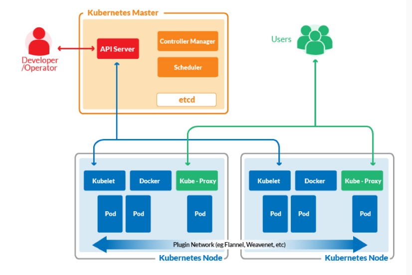
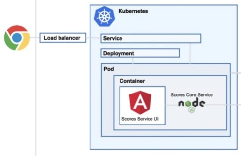
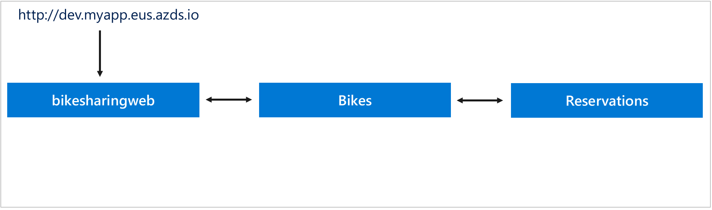

# Orchestrateur
Maintenant que nous avons vu ce qu'est un container, regardons la notion d'orchestration. Un container ne scale pas. C'est une entité unique qui ne change pas. Si on veut avoir plusieurs instance d'une image de container, il faut créer plusieurs instances et les gérer.

C'est là que l'orchestration devient intéressant. Un orchestrateur est bâtit au dessus des containers. Il gère ceux-ci. Pour permettre une certaines robustesse et/ou performance, l'orchestrateur peut créer plusieurs répliques d'un container. De plus il monitore la santé de ces derniers. Si un container est en échec, il en redémarrera un nouveau pour le remplacer.

Tout comme docker-compose, l'orchestrateur gère plusieurs services. Docker-compose n'a cependant pas toutes les charactéristiques d'un orchestrateur. Il permet de déployer une solution microservice, mais ça s'arrête là.

Voici différentes solutions d'orchestrateurs:
- Kubernetes
- Docker Swarm
- Mesos
- etc.

Le plus populaire reste Kubernetes, nous allons donc voir un peu plus en détail cette solution.

# Kubernetes
Kubernetes est divisé en master (ou control plane) et minions. Le master est responsable de la gestion de tout l'environnement. Pour ce qui est des minions (nodes), on peut en avoir une quantité variable selon les besoins de notre solution.


source: https://containerjournal.com/topics/container-ecosystems/kubernetes-vs-docker-a-primer/

# Master
Les éléments du master sont:
- API Server
- Controller Manager
- Scheduler
- etcd

## API Server
Le API Server est le moyen de communiquer avec le master. Les noeuds l'utilisent aussi.

## Controller Manager
Le controller manager exécute les fonctions du cluster tels: la réplication des composants, le monitoring des différents noeuds, la gestion des erreurs au niveau des noeuds, etc.

## Scheduler
Le scheduler est responsable de l'application: assigne un noeud à chaque composant de l'application.

## etcd
etcd est un datastore qui persiste la configuration du cluster.

# Noeuds
Au niveau des noeuds, les éléments sont:
- Kubelet
- Container Runtime (Docker, rkt ou autre)
- Kube-Proxy

## Kubelet
Le kubelet est le composent qui parle au API server et gère les containers sur le noeud.

## Container Runtime
Le container runtime est le composant qui roule les container dans le noeud. En général, Docker est utilisé, mais d'autres technologies existent: rkt, Vagrand, Cloud Factory, etc.

## Kube-Proxy
Le kube-proxy est un service qui fait le load-balancing du traffic sur le réseau entre les différents composants.

# Notions de Kubernetes


## Pods
Un Pod est la plus petite unité d'exécution d'une application Kubernetes. Il encapsule le container de l'application, les ressources de stockage et un identifiant unique réseau.

```
apiVersion: v1
kind: Pod
metadata:
  name: myapp-pod
  labels:
    app: myapp
spec:
  containers:
  - name: myapp-container
    image: busybox:1.28
    command: ['sh', '-c', 'echo The app is running! && sleep 3600']
  initContainers:
  - name: init-myservice
    image: busybox:1.28
    command: ['sh', '-c', "until nslookup myservice.$(cat /var/run/secrets/kubernetes.io/serviceaccount/namespace).svc.cluster.local; do echo waiting for myservice; sleep 2; done"]
  - name: init-mydb
    image: busybox:1.28
    command: ['sh', '-c', "until nslookup mydb.$(cat /var/run/secrets/kubernetes.io/serviceaccount/namespace).svc.cluster.local; do echo waiting for mydb; sleep 2; done"]
```

Il est possible d'utiliser un Init Container dans le cas où il est nécessaire de rouler un script avant de lancer le pod.

## Service
Le service sert à exposer une application roulant sur un ou plusieurs pods comme étant un service réseau.

Par défaut, un container n'est pas accessible. Pour le rendre accessible à l'intérieur de Kubernetes ou à l'extérieur, il faut créer un service.

Trois types de services existent:
- NodePort: Permet d'exposer un port sur le pod. Les ports vont de 30000 à 32767 et sont accessibles à l'extérieur de Kubernetes.
  ```
  apiVersion: v1
  kind: Service
  metadata:
  name: my-service
  spec:
  type: NodePort
  selector:
      app: MyApp
  ports:
      # By default and for convenience, the `targetPort` is set to the same value as the `port` field.
      - port: 80
      targetPort: 80
      # Optional field
      # By default and for convenience, the Kubernetes control plane will allocate a port from a range (default: 30000-32767)
      nodePort: 30007
  ```
- LoadBalancer: Permet de se connecter à un loadbalancer externe, ce qui rend le service disponible de l'extérieur. Si plus d'une réplique est disponible, le load balancer s'occupera de distribuer la charge sur les répliques disponibles.
  ```
  apiVersion: v1
  kind: Service
  metadata:
    name: my-service
  spec:
    selector:
      app: MyApp
    ports:
      - protocol: TCP
        port: 80
        targetPort: 9376
    clusterIP: 10.0.171.239
    type: LoadBalancer
  status:
    loadBalancer:
      ingress:
      - ip: 192.0.2.127
  ```
- ClusterIP: Expose le service sur un IP interne. Ceci fait en sorte que le service est accessible à l'intérieur de Kubernetes, mais pas de l'extérieur. C'est le type par défaut.
- ExternalName: Permet d'associer le service à une adresse externe (par exemple foo.bar.example.com).
    ```
    apiVersion: v1
    kind: Service
    metadata:
    name: my-service
    namespace: prod
    spec:
    type: ExternalName
    externalName: my.database.example.com
    ```
## Controllers
Plusieurs types de contrôleurs sont disponibles:
- ReplicaSet
- Deployments
- StatefulSets
- DaemonSet
- ConJob

### ReplicaSet
Le rôle d'un ReplicaSet est de maintenir le nombre de Pods qui roulent en même temps. Il garantie donc disponibilité d'un micro-service.
```
apiVersion: apps/v1
kind: ReplicaSet
metadata:
  name: frontend
  labels:
    app: guestbook
    tier: frontend
spec:
  # modify replicas according to your case
  replicas: 3
  selector:
    matchLabels:
      tier: frontend
  template:
    metadata:
      labels:
        tier: frontend
    spec:
      containers:
      - name: php-redis
        image: gcr.io/google_samples/gb-frontend:v3
```
### Deployment
Un déploiement encapsule la notion de ReplicaSet. Il fournit en plus le moyen de déclarer de faire des mises-à-jour sans avoir à tout recréer en plus d'autres fonctionnalités. L'utilisation des déploiements est à prévilégier.
```
apiVersion: apps/v1
kind: Deployment
metadata:
  name: nginx-deployment
  labels:
    app: nginx
spec:
  replicas: 3
  selector:
    matchLabels:
      app: nginx
  template:
    metadata:
      labels:
        app: nginx
    spec:
      containers:
      - name: nginx
        image: nginx:1.14.2
        ports:
        - containerPort: 80
```

### StatefulSets
Un StatefulSet représente un worload API utilisé pour gérer une application stateful. Il gère le déploiement et le scalling des Pods et fournit une garantie de l'ordenancement et de l'unicité des Pods. Chaque Pod aura toujours la même identity comparativement à un déploiement standard avec replicaset. Ceci fait en sorte que lorsqu'un Pod est associé à un volume, il le sera toujours dans le temps.

```
apiVersion: apps/v1
kind: StatefulSet
metadata:
  name: web
spec:
  selector:
    matchLabels:
      app: nginx # has to match .spec.template.metadata.labels
  serviceName: "nginx"
  replicas: 3 # by default is 1
  template:
    metadata:
      labels:
        app: nginx # has to match .spec.selector.matchLabels
    spec:
      terminationGracePeriodSeconds: 10
      containers:
      - name: nginx
        image: k8s.gcr.io/nginx-slim:0.8
        ports:
        - containerPort: 80
          name: web
        volumeMounts:
        - name: www
          mountPath: /usr/share/nginx/html
  volumeClaimTemplates:
  - metadata:
      name: www
    spec:
      accessModes: [ "ReadWriteOnce" ]
      storageClassName: "my-storage-class"
      resources:
        requests:
          storage: 1Gi
```

## ConfigMap
Le ConfigMap sert à identifier la configuration pour une application qui roule dans un déploiement. Il s'agit soit d'un key-value pair ou d'un fichier de configuration.

```
apiVersion: v1
kind: ConfigMap
metadata:
  name: game-demo
data:
  # property-like keys; each key maps to a simple value
  player_initial_lives: 3
  ui_properties_file_name: "user-interface.properties"
  #
  # file-like keys
  game.properties: |
    enemy.types=aliens,monsters
    player.maximum-lives=5
  user-interface.properties: |
    color.good=purple
    color.bad=yellow
    allow.textmode=true
```

Pour l'associer à un Pod ou à un déploiement, il faut le faire à l'aide de l'environnement:
```
apiVersion: v1
kind: Pod
metadata:
  name: configmap-demo-pod
spec:
  containers:
    - name: demo
      image: game.example/demo-game
      env:
        # Define the environment variable
        - name: PLAYER_INITIAL_LIVES # Notice that the case is different here
                                     # from the key name in the ConfigMap.
          valueFrom:
            configMapKeyRef:
              name: game-demo           # The ConfigMap this value comes from.
              key: player_initial_lives # The key to fetch.
        - name: UI_PROPERTIES_FILE_NAME
          valueFrom:
            configMapKeyRef:
              name: game-demo
              key: ui_properties_file_name
      volumeMounts:
      - name: config
        mountPath: "/config"
        readOnly: true
  volumes:
    # You set volumes at the Pod level, then mount them into containers inside that Pod
    - name: config
      configMap:
        # Provide the name of the ConfigMap you want to mount.
        name: game-demo
```
## Secrets
Il est possible de représenter les valeurs sensibles à l'aide des secrets. Un secret peut être associé à un Pod de deux façons:
- Comme un fichier dans un volume monté dans un ou plusieurs containers.
- Par le kubelet quand l'image est obtenue pour le Pod.

```
apiVersion: v1
kind: Secret
metadata:
  name: mysecret
type: Opaque
data:
  username: YWRtaW4=
  password: MWYyZDFlMmU2N2Rm
```

Les valeurs sont encodées en base 64.

Pour utiliser un secret dans un Pod:
```
apiVersion: v1
kind: Pod
metadata:
  name: mypod
spec:
  containers:
  - name: mypod
    image: redis
    volumeMounts:
    - name: foo
      mountPath: "/etc/foo"
  volumes:
  - name: foo
    secret:
      secretName: mysecret
      items:
      - key: username
        path: my-group/my-username
        mode: 0777
```

ou

```
apiVersion: v1
kind: Pod
metadata:
  name: secret-env-pod
spec:
  containers:
  - name: mycontainer
    image: redis
    env:
      - name: SECRET_USERNAME
        valueFrom:
          secretKeyRef:
            name: mysecret
            key: username
      - name: SECRET_PASSWORD
        valueFrom:
          secretKeyRef:
            name: mysecret
            key: password
  restartPolicy: Never
```
## Stockage
Lorsqu'on utilise de la mémoire dans un container, celle-ci est éphémère. Il est parfois nécessaire de persister les données (comme dans le cas d'une base de données). Pour ce faire, il est possible d'utiliser les volumes persistents.

### Volumes
Un volume représente un répertoire avec des données qui est acessible par un container dans un Pod. Sa longévité va avec celle du Pod. Lorsque le Pod est détuit, le volume l'est avec. Il existe plusieurs types de volumes et chacun a ses particularités:
- azureDisk
- azureFile
- nfs
- etc.

### Persistent Volumes
Un persistent volume représente un volume qui persiste dans le temps. Il existe deux types de Persistent Volumes:
- Static : Ils sont réservés à l'avance et mis à la disposition des Pods.
- Dynamic: Permet de créer le stockage sur demande.

```
apiVersion: v1
kind: PersistentVolume
metadata:
  name: pv0003
spec:
  capacity:
    storage: 5Gi
  volumeMode: Filesystem
  accessModes:
    - ReadWriteOnce
  persistentVolumeReclaimPolicy: Recycle
  storageClassName: slow
  mountOptions:
    - hard
    - nfsvers=4.1
  nfs:
    path: /tmp
    server: 172.17.0.2
```

### Persistent Volume Claims
Un PVC est un stockage réclamé par un utilisateur. Il consomme un persistent volume. Il est donc possible d'associer des propriétés à la requête de stockage: dimension, mode d'accès.

```
apiVersion: v1
kind: PersistentVolumeClaim
metadata:
  name: myclaim
spec:
  accessModes:
    - ReadWriteOnce
  volumeMode: Filesystem
  resources:
    requests:
      storage: 8Gi
  storageClassName: slow
  selector:
    matchLabels:
      release: "stable"
    matchExpressions:
      - {key: environment, operator: In, values: [dev]}
```

# Kubectl
Tout comme docker, Kubernetes fonctionne avec un outil de ligne de commandes appelé kubectl.

Cet outil permet de créer des ressources, des déploiements et de gérer kubernetes. Il utilise directement l'API du Master.

Voici un aide-mémoire pour les commandes:
https://kubernetes.io/docs/reference/kubectl/cheatsheet/

# Visual Code
Visual code a une extension très intéressante pour Kubernetes. Il aide grandement à gérer l'environnement Kubernetes.

# Helm
Helm est un outil de gestion de package (un peu comme Nuget) pour Kubernetes. Il contient des packages pré-configurés pour certaines application.

# Kubernetes et Visual Studio
Pour ajouter le support de Kubernetes à un projet, la méthode est la même que pour Docker-Compose, mais au lieu de choisir Docker-Compose, il faut choisir Kubernetes-Helm. Ceci aura pour effet d'ajouter les fichiers suivants:
- Un répertoire charts contenant tous les artefacts nécessaires pour faire un déploiement Kubernetes à l'aide de Helm. Le répertoire charts contient le package du micro-service contenu dans le projet.
- Un fichier azds.yaml qui sert à la configuration de Azure DevSpace.

Azure DevSpace est un moyen de faire du développement dans Kubernetes mis en place par Microsoft. Il permet d'avoir un environnement de développement collaboratif pour une équipe et de débugger une version d'un service.


source: https://docs.microsoft.com/fr-ca/azure/dev-spaces/quickstart-team-development

